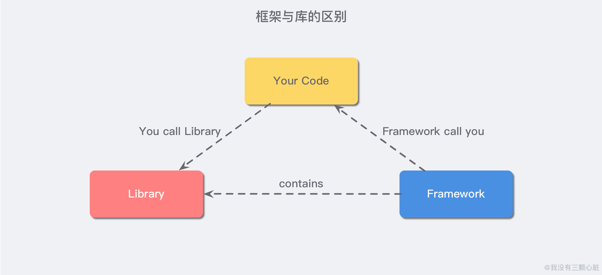
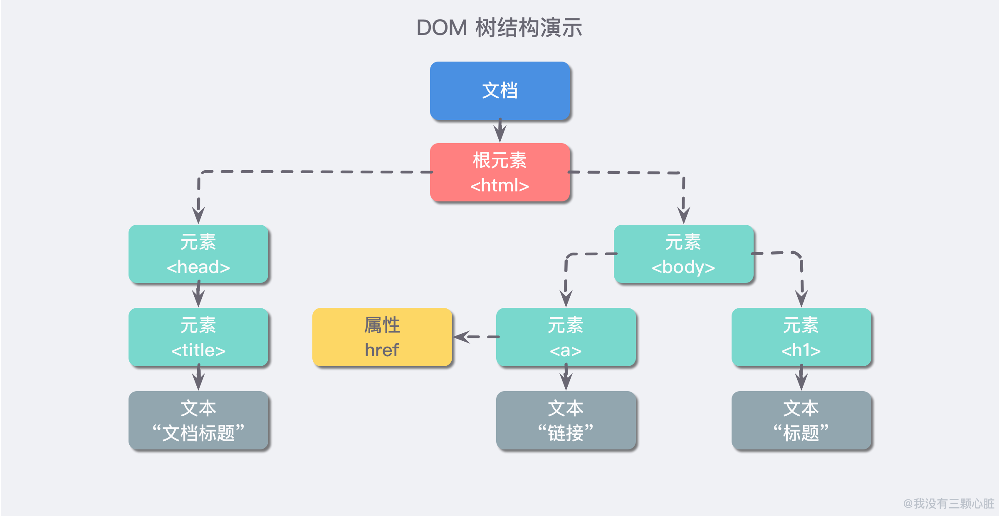

# 一、React 简介

---

## React 是什么

React 是一个起源于 Facebook 的内部项目，因为当时 Facebook 对于市场上所有的 JavaScript MVC 框架都不太满意，所以索性就自己写了一套，用来架设 Instagram。做出来之后，发现这套东西还蛮好用的，于是就在 **2013 年 5 月开源了**。

在这里我们需要稍微注意一下 **库(Library)** 和 **框架(Framework)** 的区别，**React 本身是一个用于构建用户界面的 JavaScript 库**，而我们平时所说的 React 框架其实是指的是 React/ React-router 和 React-redux 的结合体，库和框架的本质区别体现在于控制权：



- 「库」是一个封装好的特定的集合，提供给开发者使用，而且是特定于某一方面的集合（方法和函数），库没有控制权，控制权完全在于使用者本身；
- 「框架」顾名思义是一套架构，会基于自身的特点向用户提供一套比较完整的解决方案，如果使用者选定了一套框架，那么就需要根据框架本身做出一定的适应。

## 为什么使用 React？

这是一个非常有趣的问题，也让我困惑和苦恼。在笔者还在学校的时候尝试用 Vue 搭建了一套简单的博客系统，学习曲线平滑，让只会一些基础 HTML/ CSS 代码的我通过一段时间学习就能够上手了，但是学习 React 以来，进展变得相对缓慢.. 一部分原因是因为 React 创新性的开发模式以及让我感到无所适从的 JSX 语法（菜才是原罪）。

Vue 作者尤雨溪在知乎上回答「Vue 和 React 的优点分别是什么？」这个问题的时候提到 ：

> 这里我可以大方地承认，如果多年以后要论历史地位，React 肯定是高于 Vue 的。事实上，我作为一个开发者，也是由衷地佩服 Jordan Walke, Sebastian Markbage 这样的，能从开发模式层面上提出突破性的新方向的人。
>
> React 从一开始的定位就是提出 UI 开发的新思路。当年 Pete Hunt 最开始推广 React 的时候的一句口号就叫 "Rethinking Best Practices"，这样的定位使得 React 打开了一些全新的思路，吸引了一群喜欢折腾的早期核心用户，并在这个基础上通过社区迭代孵化出了许多今天被 React 开发者当作常识的 pattern。这是 React 伟大的地方，Vue 里面也有很多地方是直接受到了 React 的启发。React 敢做这样的尝试，是因为它是 Facebook。这样的体量的公司，在 infrastructure 层面获得质的提升，收益是巨大的，而且 Facebook 的工程师们足够聪明又要靠工资吃饭，改变他/她们的习惯并不是什么问题。而对外推广，则是一种大公司才有的 “改变业界” 的底气。

相比「为什么使用 React？」的理由，称赞 React 的倒是明显更多一些（React 确实是突破性的开发模式）。

是因为 React 组件化的思想吗？不是。我觉得这跟多少跟微服务化之类的概念有点儿类似，这是属于一个时代对于计算机工程的思想进步，是对于团队协作提出的新一种成熟的解决方案，也是必然的一种趋势。当前流行的不管是 Angular/ Vue 还是 React，都天然的支持着组件化的概念。

那是因为 React 性能出众吗？我想也不是。或许 React 刚出世时因为其独特高效的虚拟 DOM 设计，能够在前端江湖中平步青云，但是现在前端技术都主键地趋于成熟（我也不懂，我乱说的..），从很多地方的对比数据中，都能够看得到其实 React 与其他框架的性能差异并不是特别大。并且体现在平时的开发中，这样对比不明显的速度差异，根本没有多大的用处。

还看到一种观点，说 React 适用于构建大型的项目。从我并不多的了解中，我知道 React 体系中天然有着许多的约束，以及一些不成文的约定，这就好像是 SpringBoot 中默认提供给使用者的一些姿势，天然就有很强的工程性，加上一些约定俗成的代码风格 or 归约，这就使得 Java 很适合一些大型的团队项目。但能不能开发大型的项目从来都是取决于人，而不是采用了哪种框架。

所以比较令我信服的理由是（我乱猜的）：像 Java 一样，React 体系足够成熟，社区也非常活跃，你遇到的问题很容易在网络上找到答案，并且也有一些成熟的实践 or 轮子用以解决各种各样的问题。而且 React 还有一个比较特别的特性是：你能够比较无痛地使用 React Native 开发原生移动应用。

# 二、React 核心概念

---

## 虚拟 DOM（Vitural Document Object Model）

要理解这个「虚拟 DOM」的概念，首先我们就需要知道什么是「DOM」。我们先暂时忘掉什么网页之类的，我们想象现在我们需要编写程序来对下列的 Markdown 文档进行改变应该怎么做：

```markdown
# Title
## subtitle - 1
content - 1
## subtitle - 2
content - 2
```

比如我现在就想要 `content - 2` 的内容进行改变，那么我就需要一行一行的不断遍历直到最后遍历到它才能进行操作，对内容改变的操作都差不多，所以如果我想对这个查找的操作进行优化，最简单的想法就是把它树化以减少高度，增加效率。

**DOM** 是英文 Document Object Model 的缩写，即文档对象模型。它是一种跨平台的、独立于编程语言的 API，它把 HTML、XHTML 或 XML 文档都当做一个树结构，而每个节点视为一个对象，这些对象可以被编程语言操作，进而改变文档的结构，映射到文档的显示。DOM 最开始的时候是和 JavaScript 交织在一起的，只是后来它们最终演变成了两个独立的实体。DOM 被设计成与特定编程语言相独立，尽管绝大部分时候我们都是使用 JavaScript 来操作，但其实其他的语言一样可以（如 Python）。

假如有这么一段 HTML 代码：

```html
<html>
  <head>
    <title>文档标题</title>
  </head>
  
  <body>
    <a href="">链接</a>
    <h1>标题</h1>
  </body>
</html>
```

那么它最终就应该会是下面这棵树一样的结构：



这里不对 DOM 节点的类型啊方法之类的进行讨论，我们只需要对 DOM 有一个大致的概念就好了。


# 参考资料

---

1. [http://www.ruanyifeng.com/blog/2015/03/react.html](http://www.ruanyifeng.com/blog/2015/03/react.html) - React 入门实例教程 - 阮一峰
2. [https://www.jianshu.com/p/60100985dd7f](https://www.jianshu.com/p/60100985dd7f) - 前端框架与库的区别 
3. https://www.zhihu.com/question/301860721/answer/545031906 - Vue 和 React 的优点分别是什么？
4. https://zhuanlan.zhihu.com/p/22184194 - 你真的理解 DOM 了吗？
5. https://developer.mozilla.org/zh-CN/docs/Web/API/Document_Object_Model/Introduction - DOM 概述