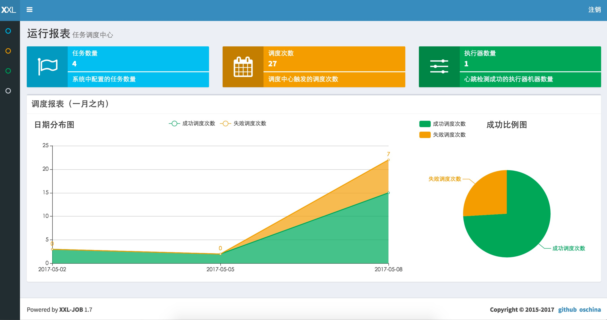
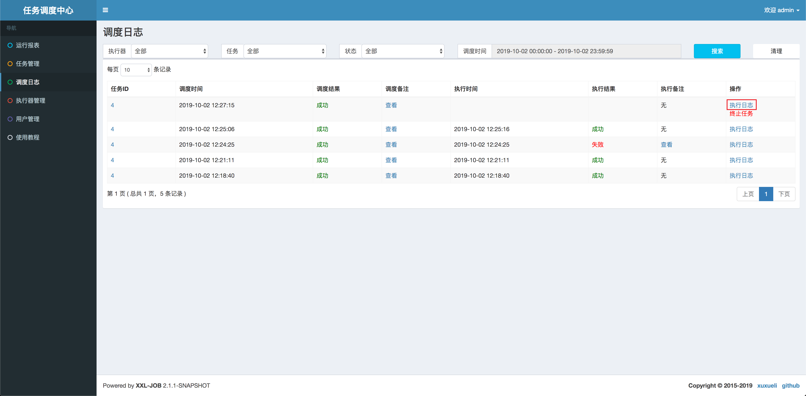
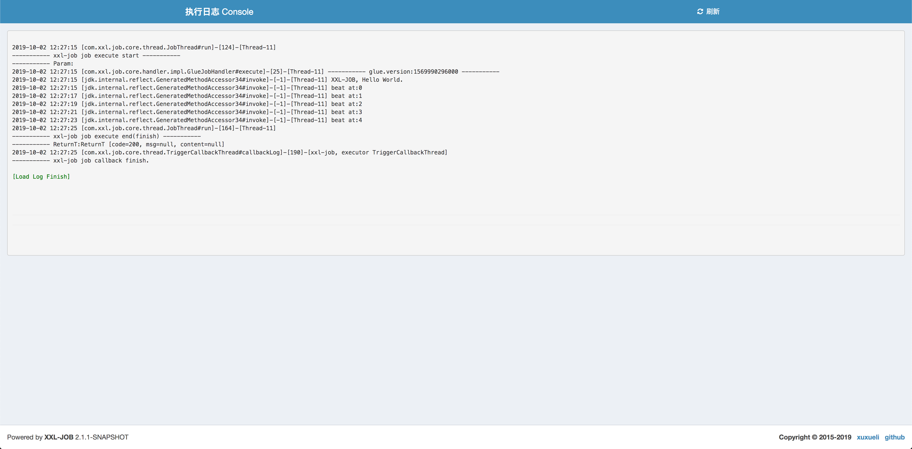
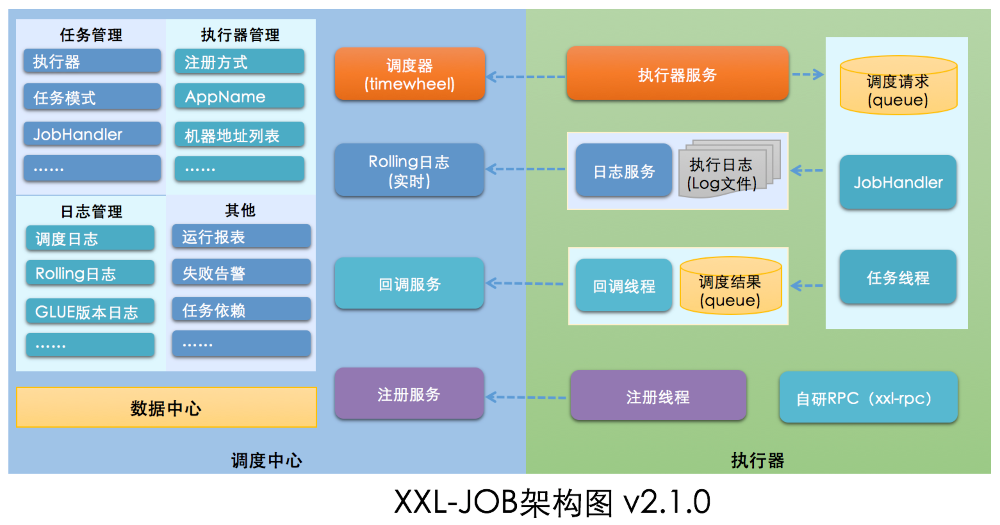
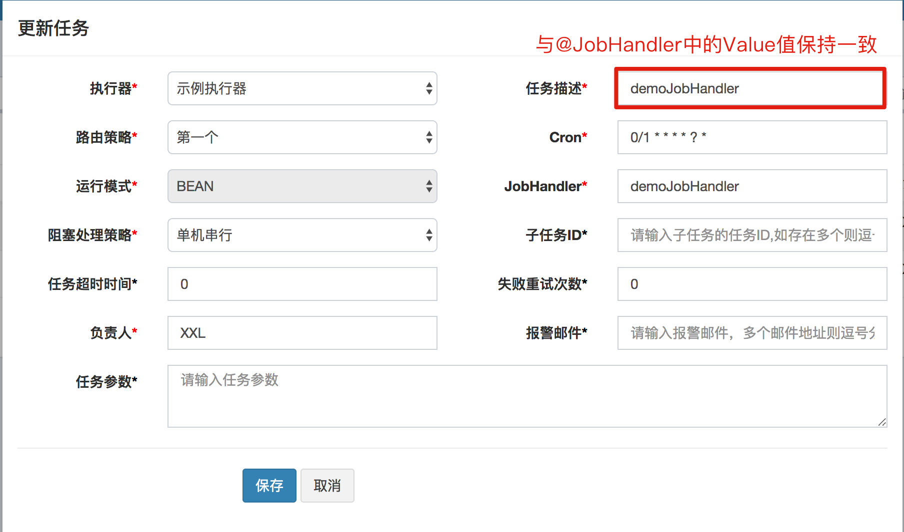

# 一、分布式任务调度概述

---

## 什么是任务调度平台

任务调度是指基于给定的时间点，给定的时间间隔又或者给定执行次数自动的执行任务。我们可以思考一下在以下场景中，我们应该怎么实现：

- 支付系统每天凌晨 1 点，进行一天清算，每月 1 号进行上个月清算；
- 电商整点抢购，商品价格8点整开始优惠
- 12306 购票系统，超过 30 分钟没有成功支付订单的，进行回收处理

## 为什么需要任务调度平台

**定时任务**是程序员不可避免的话题，很多业务场景需要我们某一特定的时刻去做某件任务。一般来说，系统可以使用消息传递代替部分定时任务（比如商品成功发货后，需要向客户发送短信提醒），两者有很多相似之处，一些场景下也可以相互替换，但是有一些不能：

- **时间驱动/ 事件驱动：** 内部系统一般可以通过事件来驱动，但如果涉及到外部系统，则只能使用时间驱动。如爬取外部网站价格，每小时爬一次。
- **批量处理/ 逐条处理：** 批量处理堆积的数据更加高效，在不需要实时性的情况下比消息中间件更有优势。而且有的业务逻辑只能批量处理，如移动每个月结算我们的花费。
- **实时性/ 非实时性：** 消息中间件能够做到实时处理数据，但是有些情况下并不需要实时，比如：vip 升级。
- **系统内部/ 系统解耦：** 定时任务调度一般是在系统内部，而消息中间件可用于两个系统间

并且对于分布式系统来说，如果处理不当，会存在同一系统不同节点之间定时任务相互影响的问题，再考虑上监控、日志、信息面板，加上不同系统之间管理维护的问题，自己实现一套的成本又上来了..所以我们可以考虑一些比较成熟的任务调度平台来使用。

## 任务调度框架选型

Java 领域主要分布式调度系统如下：

1. **xxl-job**：是一个轻量级分布式任务调度平台，其核心设计目标是开发迅速、学习简单、轻量级、易扩展 。
2. **Elastic-Job**： 当当开源的分布式调度解决方案，由两个相互独立的子项目Elastic-Job-Lite和Elastic-Job-Cloud组成；Elastic-Job-Lite定位为轻量级无中心化解决方案，使用jar包的形式提供分布式任务的协调服务；Elastic-Job-Cloud采用自研Mesos Framework的解决方案，额外提供资源治理、应用分发以及进程隔离等功能；
3. **Saturn**：是唯品会开源的一个分布式任务调度平台，在当当开源的Elastic Job基础上，取代传统的Linux Cron/Spring Batch Job的方式，做到全域统一配置，统一监控，任务高可用以及分片并发处理；
4. **light-task-scheduler**：阿里员工开源的个人项目,主要用于解决分布式任务调度问题，支持实时任务，定时任务和Cron任务。有较好的伸缩性，扩展性，健壮稳定性
5. **Quartz**: Java定时任务的标配。利用数据库的锁机制实现集群调度，业务代码需要考虑调度的逻辑，对业务代码有入侵。

在这之前，我是一个都不知道的..有很多文章对他们进行对比，我们就参考其中一篇（下 2），选择热门且成熟的 XXL-JOB 来上手研究一下。

# 二、XXL-JOB

---

## 概述

> 官方中文文档：http://www.xuxueli.com/xxl-job/

XXL-JOB是一个轻量级分布式任务调度平台，其核心设计目标是开发迅速、学习简单、轻量级、易扩展。现已开放源代码并接入多家公司线上产品线，开箱即用。

## 快速入门 - 本地运行

先定个小目标，先把它在本地跑起来先。

### 第一步：下载代码到本地

找一个合适的目录，然后执行下列语句把代码下载到本地：

```shell
$ git clone https://github.com/xuxueli/xxl-job.git
```

### 第二步：执行初始化 SQL，再用 IDEA 打开

找到 `/xxl-job/doc/db/table_xxl_job.sql` 初始化 SQL 脚本，并在本地执行。

然后按照 Maven 格式将源码导入 IDEA，源码结构如下：

```
xxl-job-admin：调度中心
xxl-job-core：公共依赖
xxl-job-executor-samples：执行器Sample示例（选择合适的版本执行器，可直接使用，也可以参考其并将现有项目改造成执行器）
    ：xxl-job-executor-sample-springboot：Springboot版本，通过Springboot管理执行器，推荐这种方式；
    ：xxl-job-executor-sample-spring：Spring版本，通过Spring容器管理执行器，比较通用；
    ：xxl-job-executor-sample-frameless：无框架版本；
    ：xxl-job-executor-sample-jfinal：JFinal版本，通过JFinal管理执行器；
    ：xxl-job-executor-sample-nutz：Nutz版本，通过Nutz管理执行器；
```

### 第三步：配置并启动 "调度中心"

调度中心配置文件地址：

```
/xxl-job/xxl-job-admin/src/main/resources/xxl-job-admin.properties
```

调度中心配置内容说明：

```properties
### 调度中心JDBC链接：链接地址请保持和初始化时创建的数据库保持一致
spring.datasource.url=jdbc:mysql://127.0.0.1:3306/xxl_job?Unicode=true&characterEncoding=UTF-8
spring.datasource.username=root
spring.datasource.password=root_pwd
spring.datasource.driver-class-name=com.mysql.jdbc.Driver

### 报警邮箱
spring.mail.host=smtp.qq.com
spring.mail.port=25
spring.mail.username=xxx@qq.com
spring.mail.password=xxx
spring.mail.properties.mail.smtp.auth=true
spring.mail.properties.mail.smtp.starttls.enable=true
spring.mail.properties.mail.smtp.starttls.required=true
spring.mail.properties.mail.smtp.socketFactory.class=javax.net.ssl.SSLSocketFactory

### xxl-job, access token
xxl.job.accessToken=

### xxl-job, i18n (default empty as chinese, "en" as english)
xxl.job.i18n=
```

在第一次启动的项目的时候可能会遇到找不到 log 文件的错误（`Failed to create`），我们只需要自己手动创建一下就好了，具体可以参照这篇文章：https://blog.csdn.net/leeue/article/details/100779424，记得之后再手动把当前目录权限置为可写状态哦：`sudo chmod 777 xxl-job`

当一切配置好了之后，我们就可以启动项目了，调度中心访问地址：http://localhost:8080/xxl-job-admin（该地址执行期将会使用到，作为回调地址），默认登录账号 "admin/123456"，登录后运行界面如下图所示：



至此，「调度中心」项目已经部署成功了，调度中心集群（可选）配置可参考官方文档。

### 第四步：配置启动"执行器"

执行器配置，配置文件地址：

```
/xxl-job/xxl-job-executor-samples/xxl-job-executor-sample-springboot/src/main/resources/application.properties
```

执行器配置，配置内容说明：

```properties
### 调度中心部署跟地址 [选填]：如调度中心集群部署存在多个地址则用逗号分隔。执行器将会使用该地址进行"执行器心跳注册"和"任务结果回调"；为空则关闭自动注册；
xxl.job.admin.addresses=http://127.0.0.1:8080/xxl-job-admin

### 执行器AppName [选填]：执行器心跳注册分组依据；为空则关闭自动注册
xxl.job.executor.appname=xxl-job-executor-sample

### 执行器IP [选填]：默认为空表示自动获取IP，多网卡时可手动设置指定IP，该IP不会绑定Host仅作为通讯实用；地址信息用于 "执行器注册" 和 "调度中心请求并触发任务"；
xxl.job.executor.ip=

### 执行器端口号 [选填]：小于等于0则自动获取；默认端口为9999，单机部署多个执行器时，注意要配置不同执行器端口；
xxl.job.executor.port=9999

### 执行器通讯TOKEN [选填]：非空时启用；(注意与调度中心保持一致)
xxl.job.accessToken=

### 执行器运行日志文件存储磁盘路径 [选填] ：需要对该路径拥有读写权限；为空则使用默认路径；
xxl.job.executor.logpath=/data/applogs/xxl-job/jobhandler

### 执行器日志保存天数 [选填] ：值大于3时生效，启用执行器Log文件定期清理功能，否则不生效；
xxl.job.executor.logretentiondays=-1
```

同样，也要注意一下日志文件的创建和权限问题，解决方法同上。

当配置完成之后运行起来，我们就可以在刚才的任务调度中心的主页，在右上角的「执行器的数量」上 + 1 了。

### 第五步：开发第一个任务

当「调度中心」和「执行器」都启动之后，我们可以直接在「调度中心」的任务管理界面新增一条配置如下图所示（参考）的任务：


我们点击「操作」按钮下的「GLUE IDE」可以手动编写我们要执行的脚本，我们可以把我们的任务代码改写成如下的样子：

```java
package com.xxl.job.service.handler;

import com.xxl.job.core.log.XxlJobLogger;
import com.xxl.job.core.biz.model.ReturnT;
import com.xxl.job.core.handler.IJobHandler;
import java.util.concurrent.TimeUnit;

public class DemoGlueJobHandler extends IJobHandler {

	@Override
	public ReturnT<String> execute(String param) throws Exception {
		XxlJobLogger.log("XXL-JOB, Hello World.");
		for (int i = 0; i < 5; i++) {
			XxlJobLogger.log("beat at:" + i);
			TimeUnit.SECONDS.sleep(2);
		}
		return SUCCESS;
	}
}
```

点击「保存」，然后继续在「操作」按钮下点击「执行一次」的操作，就可以在「调度日志」中看到我们的任务执行情况啦：



可以看到默认执行器中的日志输出了：



## 回头理解一下过程

到目前为止，我们整个搭建运行的过程都比较顺滑，没有出现什么阻碍，现在我们稍微来理解一下这个过程。

首先我们在本地初始化了框架提供的 SQL 语句，里面定义的结构足够我们不管是单机还是分布式的任务管理需求。然后我们简单配置了一下连接的数据库、报警邮件、token 等信息成功启动了「调度中心」项目。这个时候项目中默认注册一个名字为 `xxl-job-exectutor-sample` 的执行器（名字同默认执行器的 `AppName`），并且采用的是自动注册的方式。

等我们把执行器配置项里的 `xxl,job.admin.addresses` 填写上「调度中心」实际的地址，然后 token 保持与「调度中心」一致，启动执行器时，执行器就会把自身的一些基础信息发送给「调度中心」，这时候「调度中心」会把接收到的注册信息与自身注册列表里的 `AppName` 进行对比（`AppName` 是每一个执行器的唯一标示），有匹配时就会把 `ip` 自动填写上（多个节点就写多个地址），并在 `xxl_job_registry` 表上更新信息。执行器可以简单理解为项目内嵌了端口为 9999（默认端口）的一个 Server。（架构图如下）



### 任务 "运行模式"

在刚才的「快速入门」中，我们新建了一个「GLUE模式(Java)」模式的任务，我们在新建任务时可以直接在「调度中心」上编辑代码，然后让我们的  ”执行器“ 执行，这样的一种模式是把代码直接放在「调度中心」的做法，它的原理是：每个 "GLUE模式(Java)" 任务的代码，实际上是“一个继承自 “IJobHandler” 的实现类的类代码”，“执行器”接收到“调度中心”的调度请求时，会通过 Groovy 类加载器加载此代码，实例化成 Java 对象，同时注入此代码中声明的 Spring 服务（请确保 Glue 代码中的服务和类引用在“执行器”项目中存在），然后调用该对象的 execute 方法，执行任务逻辑。

另外一种方式是你提前把代码写进「执行器」程序中，这样的模式在 XXL-JOB 中叫做「Bean模式」：每个 Bean 模式任务都是一个 Spring 的 Bean 类实例，它被维护在“执行器”项目的 Spring 容器中。任务类需要加 “@JobHandler(value="名称")” 注解，因为“执行器”会根据该注解识别 Spring 容器中的任务。任务类需要继承统一接口 “IJobHandler”，任务逻辑在 execute 方法中开发，因为“执行器”在接收到调度中心的调度请求时，将会调用 “IJobHandler” 的 execute 方法，执行任务逻辑。

例如在 XXL-JOB 提供的实例代码中就有下面这么一段儿：

```java
package com.xxl.job.executor.service.jobhandler;

import com.xxl.job.core.biz.model.ReturnT;
import com.xxl.job.core.handler.IJobHandler;
import com.xxl.job.core.handler.annotation.JobHandler;
import com.xxl.job.core.log.XxlJobLogger;
import org.springframework.stereotype.Component;

import java.util.concurrent.TimeUnit;


/**
 * 任务Handler示例（Bean模式）
 *
 * 开发步骤：
 * 1、继承"IJobHandler"：“com.xxl.job.core.handler.IJobHandler”；
 * 2、注册到Spring容器：添加“@Component”注解，被Spring容器扫描为Bean实例；
 * 3、注册到执行器工厂：添加“@JobHandler(value="自定义jobhandler名称")”注解，注解value值对应的是调度中心新建任务的JobHandler属性的值。
 * 4、执行日志：需要通过 "XxlJobLogger.log" 打印执行日志；
 *
 * @author xuxueli 2015-12-19 19:43:36
 */
@JobHandler(value="demoJobHandler")
@Component
public class DemoJobHandler extends IJobHandler {

	@Override
	public ReturnT<String> execute(String param) throws Exception {
		XxlJobLogger.log("XXL-JOB, Hello World.");

		for (int i = 0; i < 5; i++) {
			XxlJobLogger.log("beat at:" + i);
			TimeUnit.SECONDS.sleep(2);
		}
		return SUCCESS;
	}
}
```

我们就能在创建任务时直接按照下图这样创建，那么在调用任务时，"执行器" 就能够如愿的执行上面的逻辑：



当然 XXL-JOB 还能支持一些脚本语言类型的模式：

```
- shell脚本：任务运行模式选择为 "GLUE模式(Shell)"时支持 "shell" 脚本任务；
- python脚本：任务运行模式选择为 "GLUE模式(Python)"时支持 "python" 脚本任务；
- nodejs脚本：务运行模式选择为 "GLUE模式(NodeJS)"时支持 "nodejs" 脚本任务；
```

# 三、接入指南

---

- 前提：已经搭建并成功运行了「调度中心」服务。

## 快速接入

**第一步**，我们需要在 pom 文件中引入 `xxl-job-core` 的 Maven 依赖，不过比较奇怪的是，明明 Github 上最新版本是 2.1.1，Maven 仓库上却没有最新的包，所以只能用 2.1.0 的：

```xml
<dependency>
  <groupId>com.xuxueli</groupId>
  <artifactId>xxl-job-core</artifactId>
  <version>2.1.0</version>
</dependency>
```

**第二步**，在配置文件中加入 xxl 相关的配置文件信息，不管 yml 格式还是 properties 都行，上面提供了 properties 的版本，这了就提供一个 yml 格式的作参考吧：

```yml
xxl:
  job:
    accessToken: xxxx
    admin:
      addresses: http://127.0.0.1:8080/xxl-job-admin
    executor:
      appname: test
      logpath: /data/applogs/xxl-job/jobhandler
      logretentiondays: -1
      ip:
      port: 9999
```

**第三步**，在合适的包目录下新建 `XxlJobConfig` 配置类：

```java
@Configuration
public class XxlJobConfig {
    private Logger logger = LoggerFactory.getLogger(XxlJobConfig.class);

    @Value("${xxl.job.admin.addresses}")
    private String adminAddresses;

    @Value("${xxl.job.executor.appname}")
    private String appName;

    @Value("${xxl.job.executor.ip}")
    private String ip;

    @Value("${xxl.job.executor.port}")
    private int port;

    @Value("${xxl.job.accessToken}")
    private String accessToken;

    @Value("${xxl.job.executor.logpath}")
    private String logPath;

    @Value("${xxl.job.executor.logretentiondays}")
    private int logRetentionDays;

    @Bean(initMethod = "start", destroyMethod = "destroy")
    public XxlJobSpringExecutor xxlJobExecutor() {
        logger.info(">>>>>>>>>>> xxl-job config init.");
        XxlJobSpringExecutor xxlJobSpringExecutor = new XxlJobSpringExecutor();
        xxlJobSpringExecutor.setAdminAddresses(adminAddresses);
        xxlJobSpringExecutor.setAppName(appName);
        xxlJobSpringExecutor.setIp(ip);
        xxlJobSpringExecutor.setPort(port);
        xxlJobSpringExecutor.setAccessToken(accessToken);
        xxlJobSpringExecutor.setLogPath(logPath);
        xxlJobSpringExecutor.setLogRetentionDays(logRetentionDays);

        return xxlJobSpringExecutor;
    }

    /**
     * 针对多网卡、容器内部署等情况，可借助 "spring-cloud-commons" 提供的 "InetUtils" 组件灵活定制注册IP；
     *
     *      1、引入依赖：
     *          <dependency>
     *             <groupId>org.springframework.cloud</groupId>
     *             <artifactId>spring-cloud-commons</artifactId>
     *             <version>${version}</version>
     *         </dependency>
     *
     *      2、配置文件，或者容器启动变量
     *          spring.cloud.inetutils.preferred-networks: 'xxx.xxx.xxx.'
     *
     *      3、获取IP
     *          String ip_ = inetUtils.findFirstNonLoopbackHostInfo().getIpAddress();
     */
}
```

至此，我们的项目就差不多完成了我们的接入工作了，就只剩下开发 Handler 的工作量了。

**第四步**，建一个示例 `DemoJobHandler` 在平台上自测一下：

```java
@JobHandler(value="demoJobHandler")
@Component
public class DemoJobHandler extends IJobHandler {

    @Override
    public ReturnT<String> execute(String param) throws Exception {
        XxlJobLogger.log("XXL-JOB, Hello World.");

        for (int i = 0; i < 5; i++) {
            XxlJobLogger.log("beat at:" + i);
            TimeUnit.SECONDS.sleep(2);
        }
        return SUCCESS;
    }
}
```

然后我们可以启动项目，看看「调度中心」是否已经成功注册当前项目的「执行器」，再使用上面介绍的「新建任务」的方法，来测试一下是否正常接入。

## 小结

总体来说 XXL-JOB 非常的容易上手，并且官方提供了很友好的实例代码，包括一些高级特性「分片」、「远程调用」等多种任务都能够很好的通过示例代码理解和使用，这里就不再详细赘述了..官方文档已经很完善了，感兴趣的小伙伴可以去阅读以下。

# 参考资料

---

1. https://www.expectfly.com/2017/08/15/%E5%88%86%E5%B8%83%E5%BC%8F%E5%AE%9A%E6%97%B6%E4%BB%BB%E5%8A%A1%E6%96%B9%E6%A1%88%E6%8A%80%E6%9C%AF%E9%80%89%E5%9E%8B/ - 分布式定时任务调度系统选型
2. https://www.yzhu.name/2019/03/30/Schedule-Job/ - 分布式调度系统选型
3. https://blog.csdn.net/qq924862077/article/details/82708610 - XXL-JOB原理--执行器注册（二）